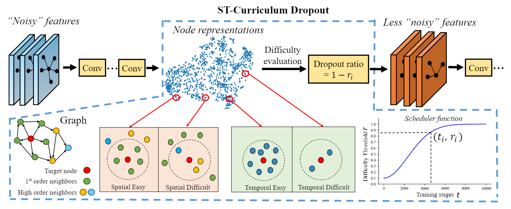

# Easy Begun is Half Done: Spatial-Temporal Graph Modeling with ST-Curriculum Dropout
<p align="center">

</p>

## Descriptions
Source code of the AAAI'23: ST-Curriculum Dropout in Spatial-Temporal Graph Modeling

## Requirements
* `Python==3.8`
* `pytorch==1.7.1`
* `torch-summary (>= 1.4.5)`
you will get some error if you installed torchsummary, see the details at https://pypi.org/project/torch-summary/. please uninstall torchsummary and run pip install torch-summary to install the new one.


#### Running
  `python main.py`

#### Dataset
We provide sample data under data/.

The project structure is organized as follows:
```
├── data
│   └── METRLA 
│       ├── metr-la.h5    # signal observation
│       ├── W_metrla.csv  # adj maxtrix
├── img
│   └── framework.png # image of model framework
├── models
│   ├──  STGCN.py # STGCN framework
│   ├──  Param.py # hyper parameter 
├── save
├── main.py
├── README.md
└── utils
    ├── Metrics.py # evaluation metrics 
    ├── Utils.py  
```

# Reference
If you make advantage of the STC-Dropout in your research, please cite the following in your manuscript:

```
@article{wang2022easy,
  title={Easy Begun is Half Done: Spatial-Temporal Graph Modeling with ST-Curriculum Dropout},
  author={Wang, Hongjun and Chen, Jiyuan and Pan, Tong and Fan, Zipei and Zhang, Boyuan and Jiang, Renhe and Zhang, Lingyu and Xie, Yi and Wang, Zhongyi and Song, Xuan},
  booktitle = {{AAAI}},
  publisher = {{AAAI} Press},
  year      = {2023}
}
```
